# 🩺 MedAssist AI   https://medassistaipoc.netlify.app/

> **Claude-powered clinical workflow platform** — built as a product prototype by [Krishna Chowdari Paruchuri](https://github.com/krishnaparuchuri-productmanager), Product Manager.

## 🎬 Demo Walkthrough

> All screenshots and video below use **synthetic demo data** (patient: Priya Menon, P1003 — fictional).
> LLM status verified: `claude-sonnet-4-6` active and usable at time of recording.

### 📹 Demo Video (~65 seconds)

<video src="docs/demo-assets/demo.mp4" controls width="100%" style="border-radius:12px"></video>

> Can't see the video? [Download demo.mp4](docs/demo-assets/demo.mp4)

---

### 📸 Screenshots

#### Login
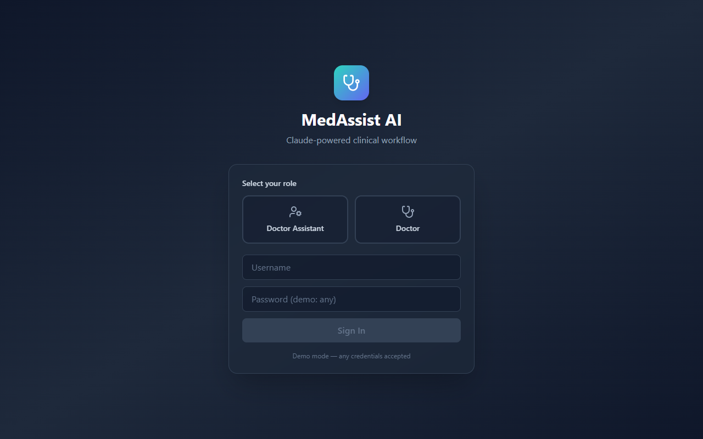
*Role selector — Doctor Assistant or Doctor portal*

#### 👩‍💼 Doctor Assistant Portal

**Patient Registration + AI Intake Insights**
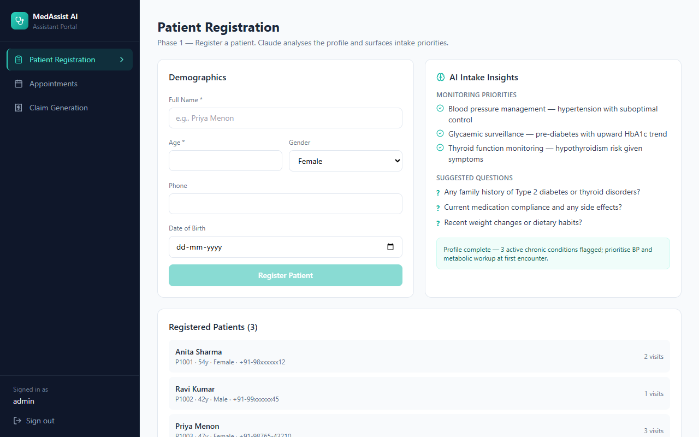
*Claude analyses the patient profile and surfaces monitoring priorities, suggested intake questions, and a completeness note*

**Appointment Scheduling**
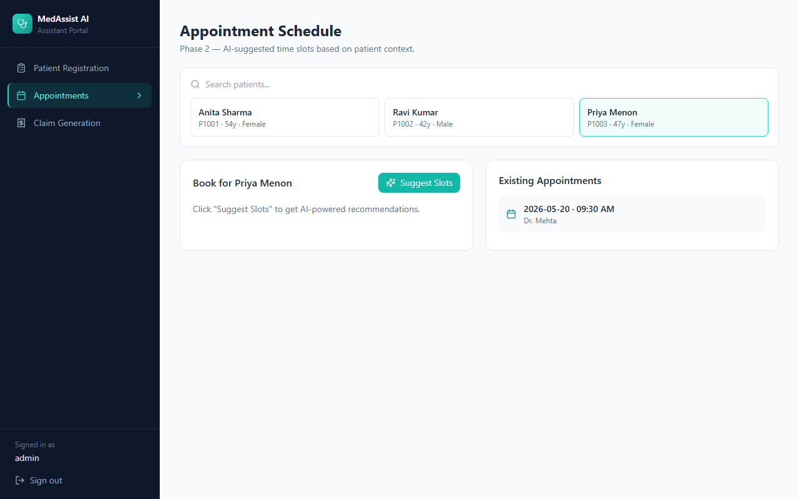
*AI-suggested time slots with clinical reasoning based on patient history*

**Claim Generation**
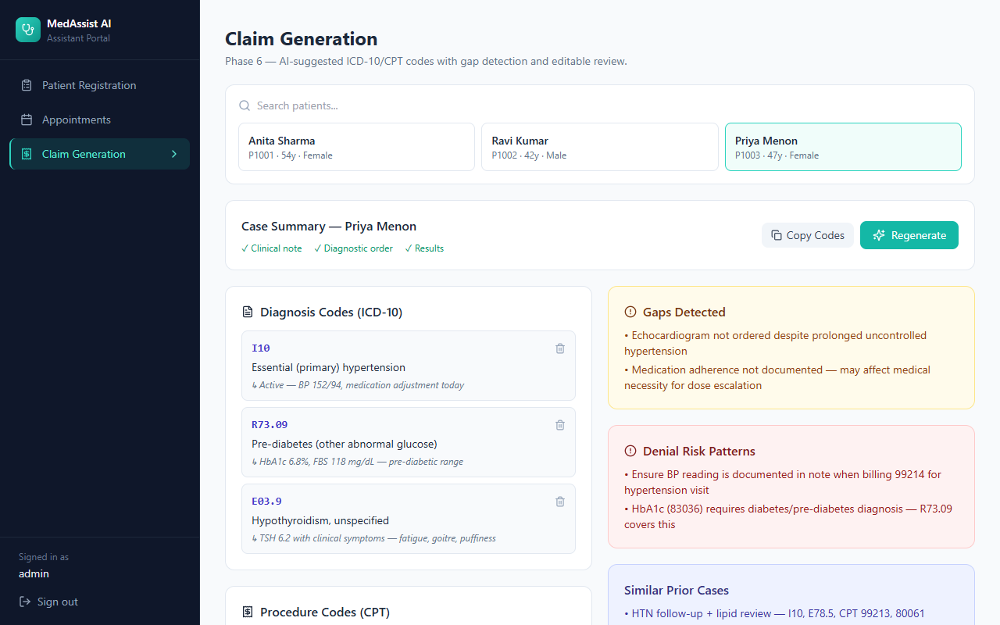
*Auto-generated ICD-10 + CPT codes with gap detection and denial risk analysis*

#### 🩺 Doctor Portal

**Patient Details**
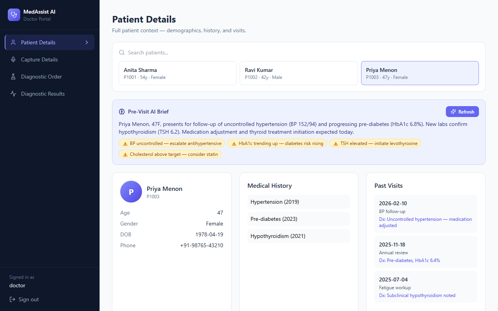
*Full demographics, medical history, and past visits*

**Pre-Visit AI Brief**

*Claude generates a concise pre-encounter summary with time-sensitive alerts*

**Capture Details — SOAP Note**
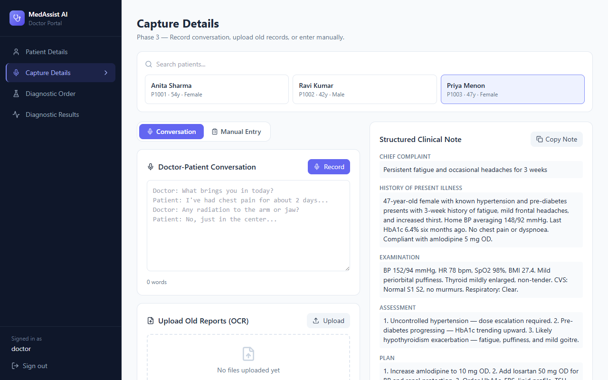
*Structured SOAP note extracted from a doctor-patient conversation, with extracted orders and gap flags*

**Diagnostic Orders — LOINC Mapping**
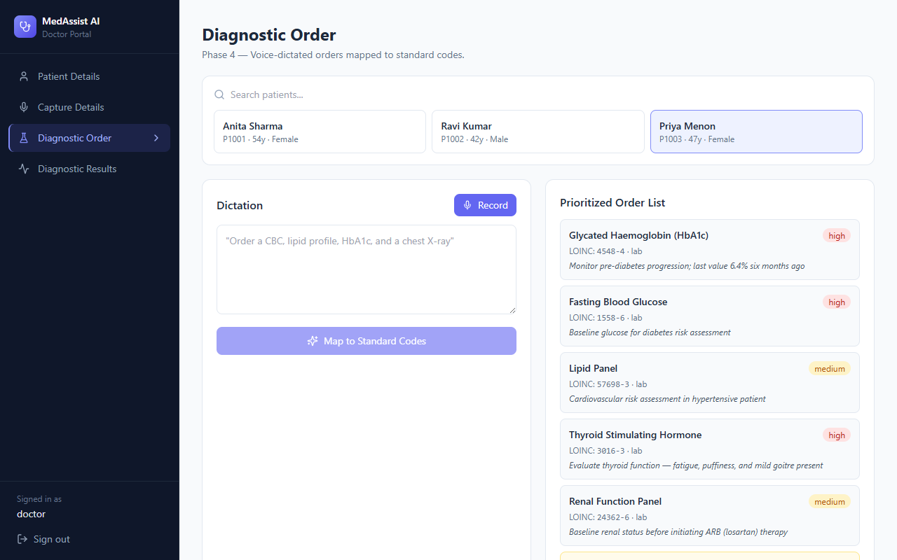
*Voice-dictated orders mapped to standard LOINC codes with priority and rationale*

**Diagnostic Results — Lab Analysis**

*Lab values analysed, abnormals flagged, read-aloud summaries generated*

**Diagnostic Results — Trend Chart**
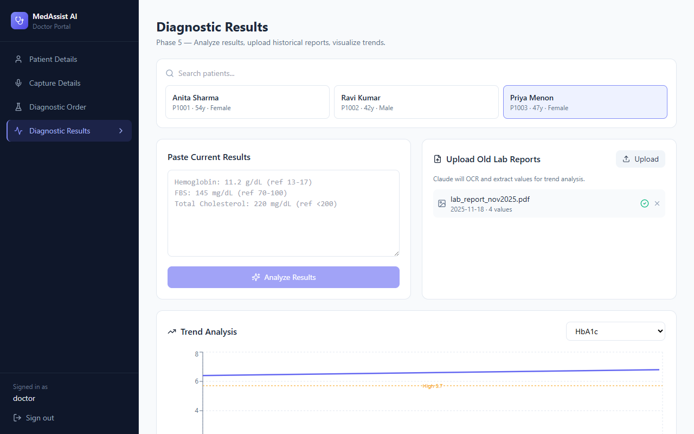
*Lab values visualised across historical uploads with reference range overlays*

---

> 📋 Full code review, AI agent opportunities, and demo data details:
> [`docs/demo-assets/ai-agent-review.md`](docs/demo-assets/ai-agent-review.md)

---

## 🎬 Original Product Walkthrough

<video src="docs/walkthrough.mp4" controls width="100%" style="border-radius:12px"></video>

> Can't see the video? [Download walkthrough.mp4](docs/walkthrough.mp4)

A full-stack React web application that uses Anthropic's Claude API to automate and augment every stage of a clinical encounter — from patient registration through to insurance claim generation.

---

## 📸 Screenshots

### Login


### 👩‍💼 Doctor Assistant Portal

**Patient Registration** — Register patients; Claude generates AI Intake Insights (monitoring priorities, suggested questions, intake note)
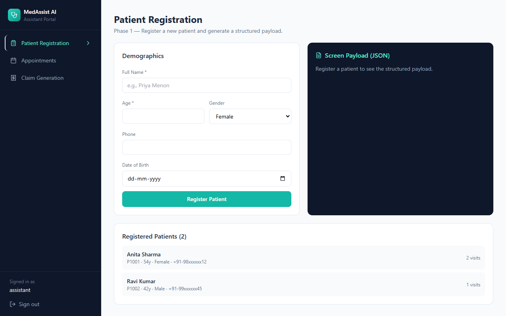

**Appointment Schedule** — AI-suggested time slots based on patient context
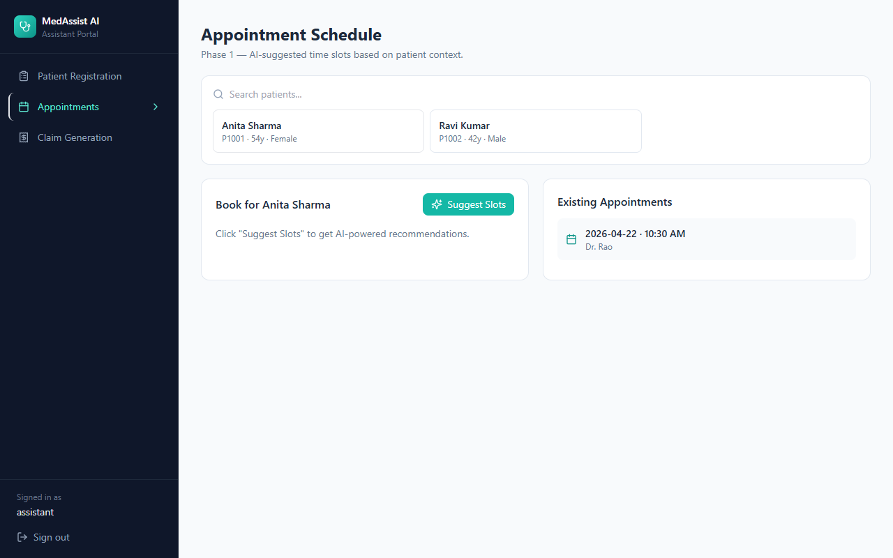

**Claim Generation** — Auto-generates ICD-10/CPT codes with gap detection
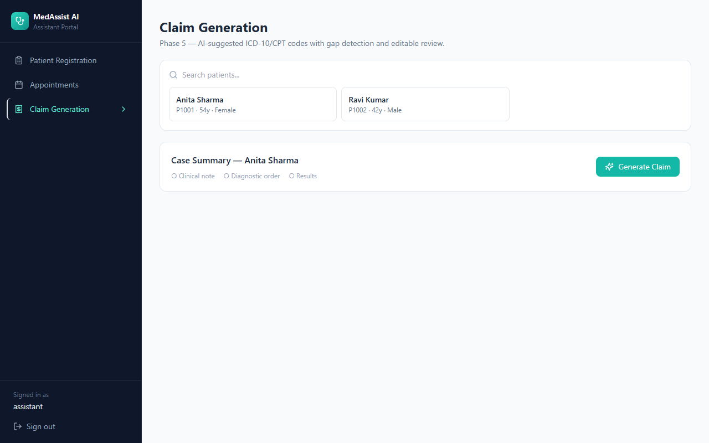

### 🩺 Doctor Portal

**Patient Details** — Full demographics, medical history, and past visits
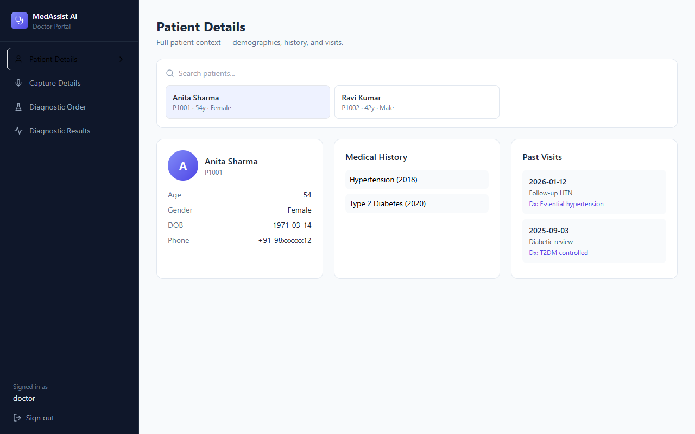

**Capture Details** — Voice transcription and SOAP note extraction
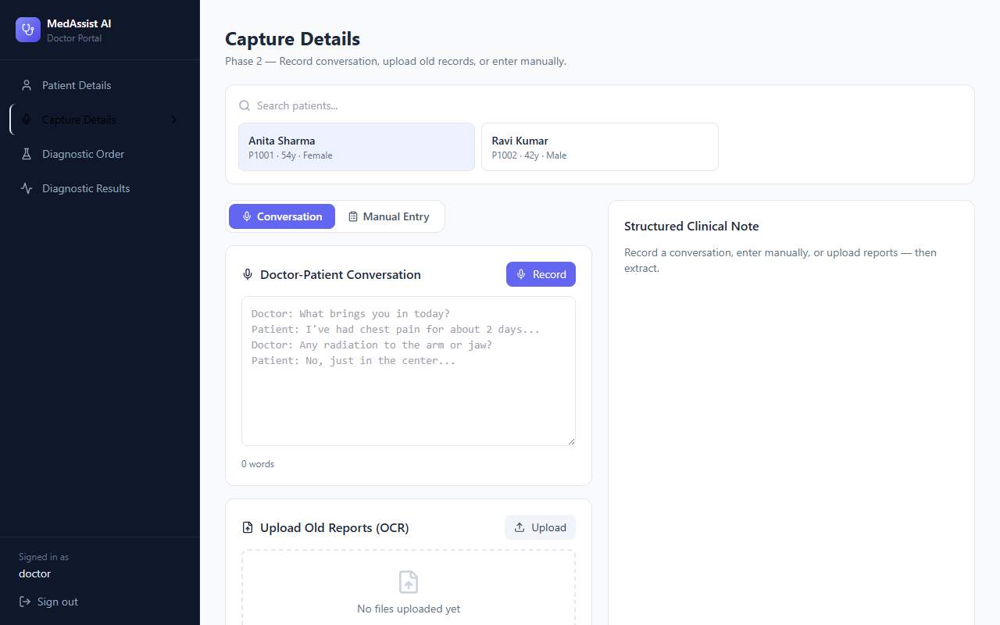

**Diagnostic Order** — Voice-dictated orders mapped to LOINC codes
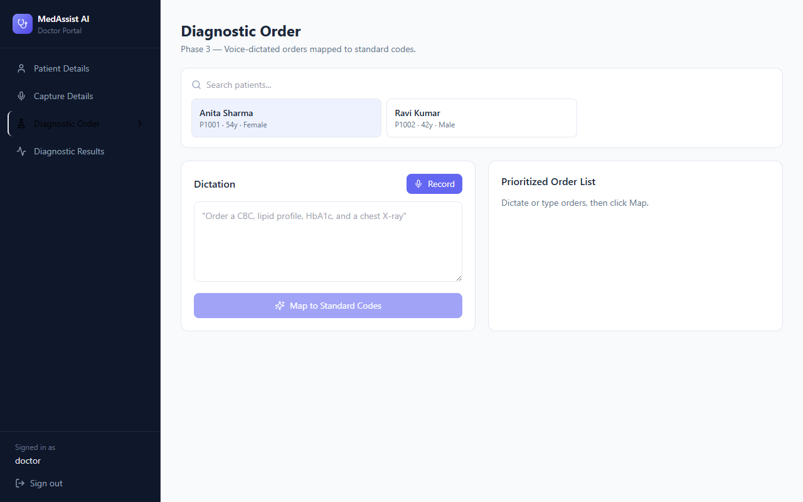

**Diagnostic Results** — Lab analysis, abnormality flagging, and trend charts
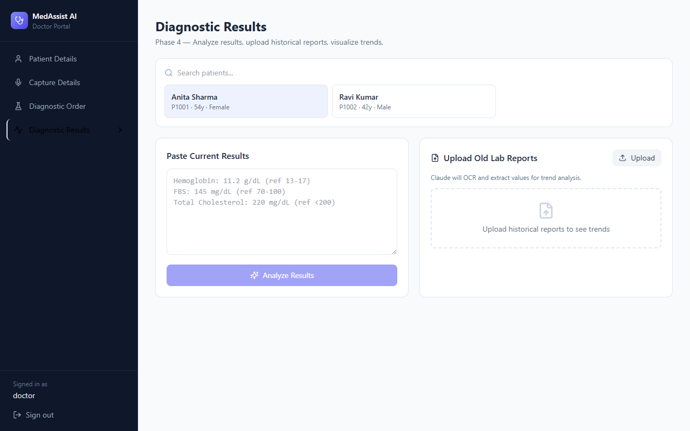

---

## ✨ What It Does

MedAssist AI covers **6 phases** of the clinical workflow across two role-based portals:

### 👩‍💼 Doctor Assistant Portal
| Screen | What Claude Does |
|--------|-----------------|
| **Patient Registration** | Registers patients and generates AI Intake Insights — monitoring priorities, suggested questions, and an intake note |
| **Appointment Scheduling** | Suggests time slots with AI rationale based on patient history |
| **Claim Generation** | Auto-generates ICD-10 + CPT codes, flags denial risks, compares against prior cases |

### 🩺 Doctor Portal
| Screen | What Claude Does |
|--------|-----------------|
| **Patient Details** | Displays full demographics, medical history, past visits, and generates a Pre-Visit AI Brief |
| **Capture Details** | Transcribes doctor-patient conversations (live mic or text), extracts SOAP notes via Claude, OCRs uploaded medical reports |
| **Diagnostic Orders** | Maps voice-dictated orders to LOINC codes with priority and rationale |
| **Diagnostic Results** | Analyzes lab values, flags abnormals, reads results aloud, visualizes trends across historical uploads |

---

## 🛠 Tech Stack

| Layer | Technology |
|-------|-----------|
| Frontend | React 18 + Vite |
| Styling | Tailwind CSS |
| Charts | Recharts |
| Icons | Lucide React |
| AI | Anthropic Claude (`claude-sonnet-4-6`) |
| API Proxy | Netlify Functions (server-side — key never reaches the browser) |
| Voice | Web Speech API (built-in browser) |
| OCR | Claude Vision (PDF + image) |

---

## 🚀 Getting Started

### Prerequisites
- Node.js 18+
- An [Anthropic API key])

### Installation

```bash
git clone https://github.com/krishnaparuchuri-productmanager/medassist-ai.git
cd medassist-ai
npm install
```

### Configuration

All API calls go through a Netlify serverless function (`netlify/functions/claude.js`) — the API key **never reaches the browser**.

For **local development**, create a `.env.local` file in the root:

```env
ANTHROPIC_API_KEY=sk-ant-your-key-here
```

Then run with the Netlify CLI so the function is available locally:

```bash
npx netlify dev
```

Or, if you just want to run the frontend without the Netlify function layer:

```bash
npm run dev
```

> ⚠️ With `npm run dev` alone, Claude features won't work because `/.netlify/functions/claude` isn't served. Use `npx netlify dev` for full local functionality.

For **Netlify deployment**, set `ANTHROPIC_API_KEY` in your Netlify site's **Environment Variables** (Site Settings → Environment Variables). Do **not** use the `VITE_` prefix — that would expose the key in the browser bundle.

Open [http://localhost:8888](http://localhost:8888) when using `netlify dev`, or [http://localhost:5173](http://localhost:5173) for frontend-only.

---

## 📁 Project Structure

```
medassist-ai/
├── index.html
├── package.json
├── vite.config.js
├── tailwind.config.js
├── postcss.config.js
├── .gitignore
├── netlify/
│   └── functions/
│       └── claude.js   # Secure server-side proxy — API key lives here only
└── src/
    ├── main.jsx        # React entry point
    ├── index.css       # Tailwind base styles
    └── App.jsx         # All screens, components, and Claude API logic
```

---

## 🎯 Key Features

- **Role-based login** — Doctor vs. Doctor Assistant, each with a tailored sidebar and workflow
- **Live voice transcription** — Real-time mic capture using the Web Speech API
- **Claude-powered SOAP extraction** — Converts raw conversation text into structured clinical notes
- **OCR via Claude Vision** — Upload handwritten or printed lab reports (PDF/image) and extract values automatically
- **Trend visualization** — Line charts with reference range overlays across historical lab uploads
- **Text-to-speech readout** — Results read aloud using the browser's Speech Synthesis API
- **ICD-10 / CPT claim generation** — AI-coded claims with gap detection and denial risk analysis
- **LOINC code mapping** — Voice-dictated diagnostic orders mapped to standard codes with rationale

---

## 🔒 Security Note

This is a **prototype / demo application**. Patient data is held in React state only (no database).

**What's already secured:**
- All Claude API calls are proxied through `netlify/functions/claude.js` — the API key is a server-side environment variable and is never bundled into the browser JavaScript
- The proxy whitelists allowed models and caps `max_tokens` to prevent cost abuse
- CORS headers are enforced on the function

**For any real clinical use, additionally:**
- Implement proper authentication and session management
- Use HIPAA-compliant infrastructure and data storage
- Do not store real patient data in browser state

---

## 👤 About

Built by **Krishna Chowdari Paruchuri** as an AI product prototype demonstrating how large language models can streamline clinical workflows for doctors and medical staff.

- GitHub: [@krishnaparuchuri-productmanager](https://github.com/krishnaparuchuri-productmanager)
- Email: krishna1parchuri@gmail.com

---

## 📄 License

MIT — free to use, fork, and build upon.
